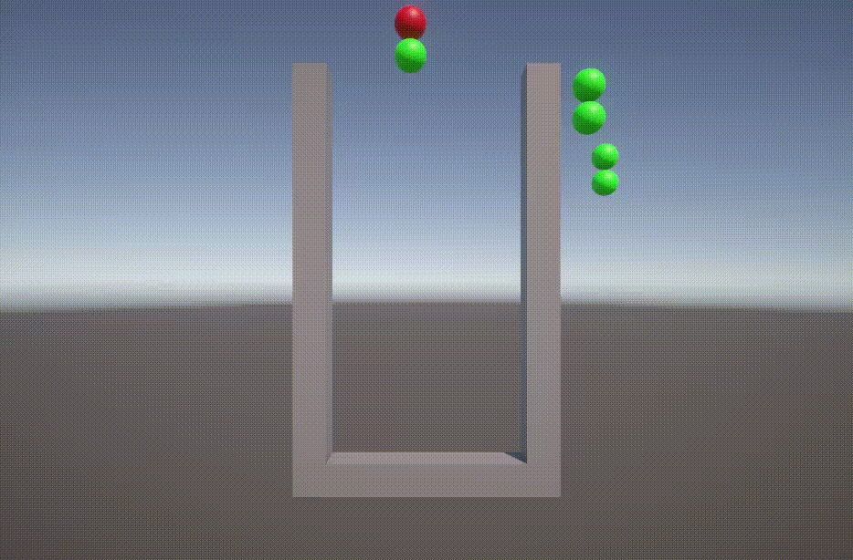
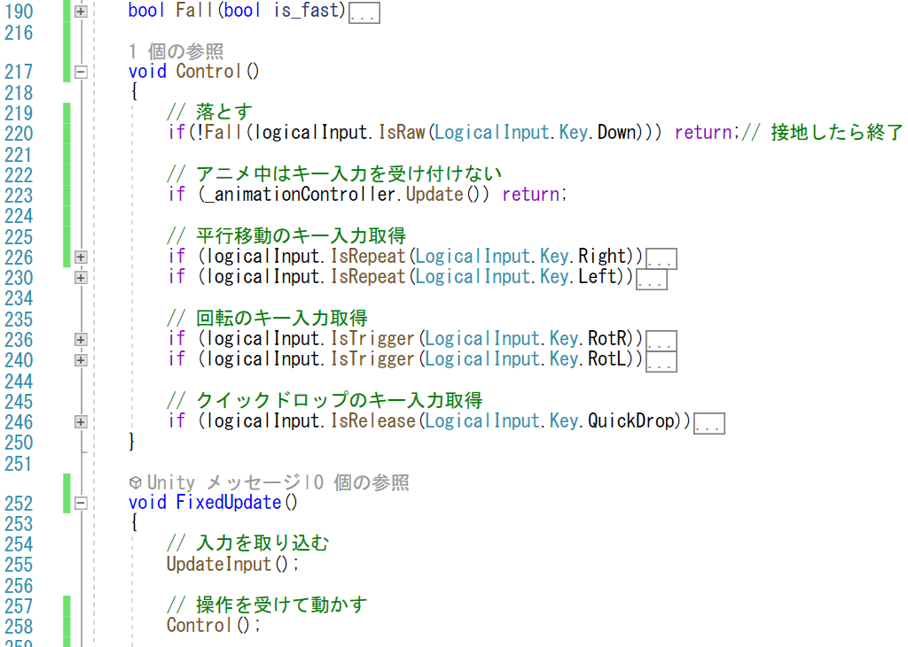
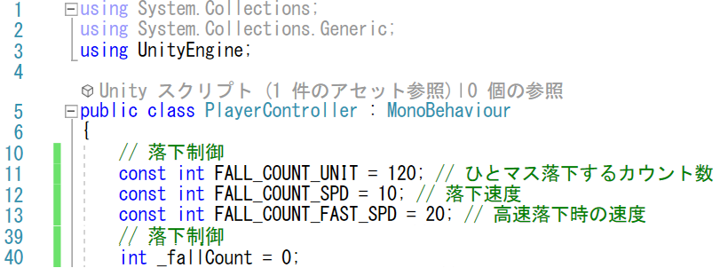
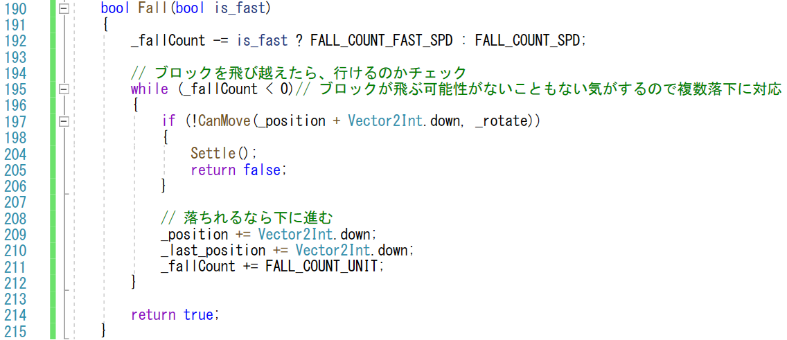
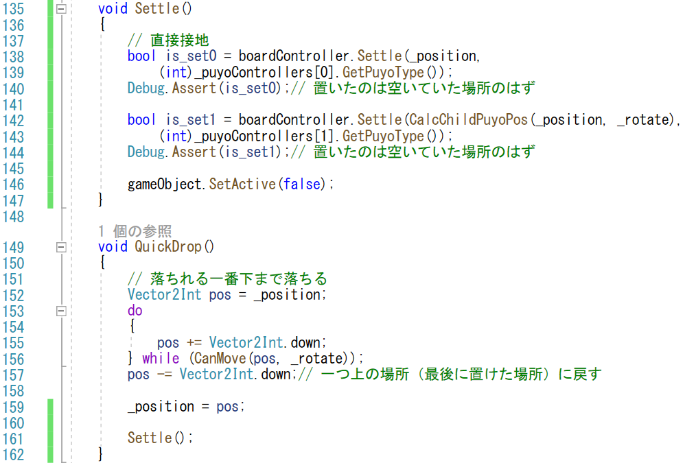
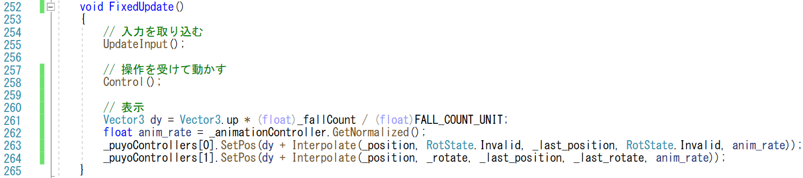
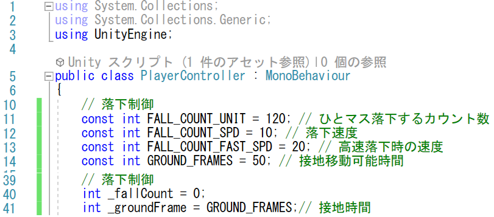
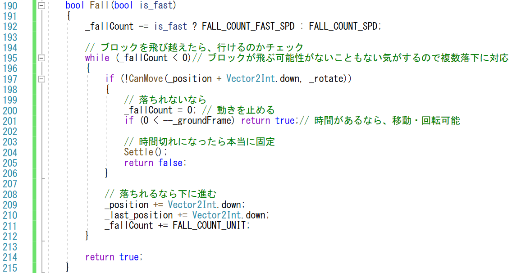

# 概要
ぷよは時間と共に少しずつ落ちてくるものです。
なめらかに上から下まで落としていきましょう。

# 手順
## 落とす
落とす処理ですが、ボードのマスの中にしばらく滞在して、
時間が来たら次のマスに移動します。
あとは、マス内で滞在している時間に応じて滑らかにつながるように
表示する場所を変えれば、見た目的にはすーっと落ちてくるようになります。

最初に落ちてくる処理を入れる場所を考えましょう。
ぷよは落ちている時も左右に動かせますし、回転もできます。
従って、落とす処理を入れる場所は、移動や回転のアニメーション中にスキップされてはいけません。
逆に、落ちてきて、下に固定されたらもう移動や回転はできません。
つまり、固定されたらその後の回転や移動の処理に行かないように
しなくてはなりません。
ただ、「↓」を押せば速く落ちるという仕様もあるので、落とす処理は入力処理をした後になりそうです。
従って、落ちる処理が入るタイミングは、「FixedUpdate」内の「UpdateInput」メソッドよりも後のある程度早い場所という事になります。
今回は、「Control」メソッドの中に押し込めてみます。
今まで、「AnimationController」の「Update」メソッドは「Control」メソッドの外にありましたが、そちらも中に入れて、
その後の処理を行わない場合は、早期returnで流れを変えることにします。

まとめると、次の処理を行います。

- 「AnimationController」の「Update」メソッドを「Control」メソッド内に入れる (223行目)
- 「AnimationController」の「Update」メソッドでアニメーション中であったら、早期returnでメソッドを終える
- 「Fall」メソッドを導入する (220行目)
  - 速く落とすかどうかをbool型の引数で渡すようにしてみる
  - 落ちきったら、処理を継続せず終了する

落とす処理「Fall」ですが、その説明の前に、メソッド内で使われるメンバー変数を見ていきます。
落とす処理では、マス内にいる時間を数えるためのメンバー変数「_fallCount」を用意します(40行目)。落ちるたびにこの数を減らして行って、負になったら下のマスに移していきます。
「_fallCount」は落ちるフレーム数を直接指定しても良いのですが、通常の落ちる速度とはやく落ちる速度を微妙に調整できるように大きな値を指定するようにします。
具体的には、通常の速度を「FALL_COUNT_SPD」(10)、はやく落ちる速度を「FALL_COUNT_FAST_SPD」(20)とします。
「_fallCount」に設定される値「FALL_COUNT_UNIT」(120)がこれらの速度で毎フレーム引いていきます。

処理としては、この変数を早いか遅いかによって切り分けて、
負になったら別のマスに移ったという事で、
下にいければ下に行って、イケなければ固定します。

- 「_fallCount」を速度に応じて減らす (192行目)
- 「_fallCount」が負になったら、下に移動できるか調べる (197行目)
- 下に移動できないのであれば設置して終了 (204行目)
- 下に移動できるのであれば、下に動かして、「_fallCount」を増やしておく (209行目から211行目)
  - 「_fallCount」を増やすときは、その次に落ちる時間まで滑らかにつなぐように、「_fallCount = FALL_COUNT_UNIT;」ではなく、「_fallCount += FALL_COUNT_UNIT;」にしている
  - もし、一フレームで数マス落ちることがあるかもしれないと考え、この判定をwhileループで回せるだけ回しておく
    - 「FALL_COUNT_FAST_SPD」等の値が「FALL_COUNT_UNIT」よりも大きくなると起きる。設定ミスが起きたときの対策

固定処理「Settle」は、今までに出てきていないメソッドですが、
その中身は今までに登場してきました。
クイックドロップで地面に付ける処理と同じものになります。具体的には、次の内容です。

- ボードクラスへの書き込み (138-144行目)
- 自分自身の非アクティブ化 (146行目)

同じ処理が使われるので、今回、「QuickDrop」メソッドに書かれていた処理を抜き出して、メソッド「Settle」にしました。

### 表示

「_fallCount」メンバーは、下に落とす際のカウンターとして使われるだけではなく、表示する位置をずらす処理にも使います。
ぷよのゲームオブジェクトの位置を指定する処理 (263-264行目) で、上方向に滞在時間の割合「_fallCount / FALL_COUNT_UNIT」 (261行目) だけ動かすことで、マスの中を滑らかに動くように見せます。

## 少し待って固定

実は、ぷよは地面などに着いたときに直ぐに固定されるわけではありません。
着いてから少しの間は（動けるのであれば）移動や回転ができるようになっています。
この処理は、あらかじめカウンタを用意し、地面に着いた際はこのカウンタを減らして、カウンタが0になったところで本当に固定すれば実現できます。
従って、準備としては、次のようにメンバーを追加・初期化します。

- 接地時間を数えるカウンタ「_groundFrame」を用意 (41行目)
- 「_groundFrame」に遊びの時間「GROUND_FRAMES」 (14行目) を設定

落下処理は次のように変更を受けます。

- 接地したら、カウンタ「_groundFrame」を減らす (201行目)
- カウンタ「_groundFrame」が0になったら接地
- カウンタ「_groundFrame」が0でなければ、平行移動・回転はできる形で終了
- 一度設置したら、次に落ちる際は落ち直しなので、「_fallCount」を0にする (200行目)
  - 次のフレームで落ちれるようなら、少し先に進んだ形ではなくて、その位置から落ち始めるようにしておく

# 検証

少しづつ落ちて、下に着いたときに固定されれば完成です。
